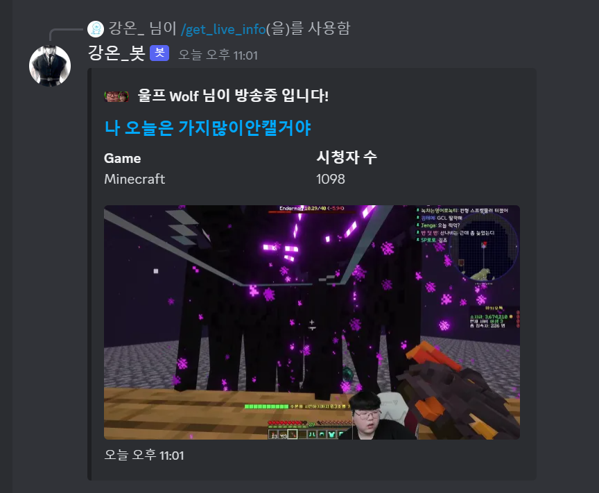

## GangOn Bot

### ❄️ 2023.12.31

> 내 서버에서 테스트 할려고 쓸 용도로 만든 discord bot

### ❄️ 2024.01.01

> axios 사용하여 naver chzzk api (비공식) 채널 데이터 가져오기

### ❄️ 2024.01.02

> chzzk api class 만들었습니다
> promise 비동기로 discord에서도 문제없이 데이터를 가져와서 뿌릴수있게 작업 했습니다.

### ❄️ 2024.01.03

> chzzk api - LiveStatus Class 만들고 ChzzkApi를 Extends 받았습니다.
> live 중이면 방송 정보, 방송 타이틀, 게임, 시청자 수 를 discord embed에 넣은 뒤 뿌려줍니다.

 
 

`24.01.01`

- [x] axios로 네이버 치지직 api 가져오기

`24.01.02`

- [x] 네이버 치지직 api 에서 가져온 데이터 class로 분류 할수있도록 처리 하기
- [x] discord.js 로 뿌려보기
- [x] discord.js embed replay 해보기

`24.01.03`

- [x] discord.js live-detail axios로 가져온 뒤 class로 처리 후 embed 뿌리기

`24.01.04`

- [x] aws ec2 새로운 인스턴스 만들고 거기에 node.js 셋팅
- [x] github repository 새로 파서 discord_bot 자체를 이동

`future`

- [ ] setInterval로 어떻게 로직 짤지 구상
- [ ] db 구상
- [ ] 서버 구상

> 사진

